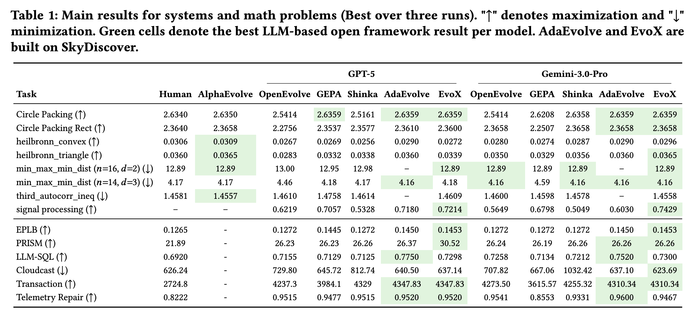
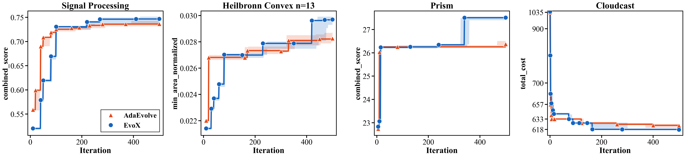

<h1 align="center">
  &nbsp;

  <b>SkyDiscover</b>
</h1>


 <p align="center"> A Flexible Framework for AI-Driven Scientific and Algorithmic Discovery</p>
  <p align="center">
  <a href="https://skydiscover-ai.github.io/blog.html"></a>
  <a href="https://arxiv.org/abs/2602.20133"></a>
  <a href="https://arxiv.org/abs/2602.23413"></a>
  <a href="LICENSE"></a>
  </p>


   <p align="center">
  <br>
</p>


**SkyDiscover** is a modular framework for AI-driven scientific and algorithmic discovery, providing a unified interface for implementing, running, and fairly comparing discovery algorithms across 200+ optimization tasks.

SkyDiscover introduces two new adaptive optimization algorithms:

- **[AdaEvolve](https://arxiv.org/abs/2602.20133)**, which dynamically adjusts its optimization behavior based on observed progress.
- **[EvoX](https://arxiv.org/abs/2602.23413)**, which dynamically evolves the optimization (evolution) strategy itself using LLMs on the fly.

SkyDiscover also supports using OpenEvolve, ShinkaEvolve and GEPA to quickly benchmark these algorithms using their own source code. SkyDiscover also hosts native versions of OpenEvolve and GEPA under `openevolve_native` and `gepa_native` algorithms using the modular interface.

SkyDiscover natively supports [Harbor](https://harborframework.com/)-format benchmarks, so you can run external benchmark suites out of the box, including [AlgoTune](https://github.com/oripress/AlgoTune), [EvoEval](https://github.com/evo-eval/evoeval), [HumanEvalFix](https://github.com/bigcode-project/octopack), [BigCodeBench](https://github.com/bigcode-project/bigcodebench), [LiveCodeBench](https://livecodebench.github.io/), [USACO](https://usaco.org/), [CRUSTBench](https://github.com/AInfinity/CRUSTBench), and [CodePDE](https://github.com/).
> 🚧 This project is under active development.

---

## 🏆 Benchmark Performance

Across ~200 optimization benchmarks, AdaEvolve and EvoX achieve the strongest open-source results: matching or exceeding AlphaEvolve and human SOTA, and outperforming OpenEvolve, GEPA, and ShinkaEvolve under identical generation budgets.

- **Frontier-CS (172 problems)**: ~34% median score improvement over OpenEvolve, GEPA, and ShinkaEvolve  
- **Math + Systems Optimization (14 tasks evaluated)**: Matches or exceeds AlphaEvolve and human-designed SOTA on 6/6 systems and 6/8 math tasks
- **Real-world systems impact**: 41% lower cross-cloud transfer cost, 14% better GPU load balance for MoE serving, and 29% lower KV-cache pressure via GPU model placement

<p align="center">
  
</p>

<details>
<summary><b>📊 Complete results of AdaEvolve and EvoX (100 iterations)</b></summary>

> AdaEvolve and EvoX are **complementary**: AdaEvolve adapts search *parameters* for fast early gains; EvoX evolves the search *strategy itself* for stronger long-horizon gains. Both are built on SkyDiscover.

<p align="center">
  
</p>

</details>

<details>
<summary><b>📈 Scaling behavior of AdaEvolve and EvoX</b></summary>

The scaling behavior of AdaEvolve and EvoX shows a **complementary crossover**. AdaEvolve's per-iteration parameter adaptation yields fast early gains in low-budget runs (T≤50), while EvoX's demand-driven strategy evolution unlocks step-change improvements in longer runs (T≥50).

<p align="center">
  
  <br><em>Best-so-far score vs. iteration for Signal Processing, Heilbronn Convex, Prism, and Cloudcast (500 iterations, GPT-5).</em>
</p>

</details>

<details>
<summary><b>🔗 Evolving AdaEvolve's policy with EvoX (coming soon)</b></summary>

The two methods are **composable**: EvoX can evolve using AdaEvolve as its starting strategy, achieving the best results on 3 out of 4 benchmarks (100 iterations, GPT-5). This combined mode will be available in SkyDiscover soon.

| Benchmark | AdaEvolve | EvoX (Random Init) | EvoX (AdaEvolve Init) |
|:--|--:|--:|--:|
| Signal Proc. (↑) | 0.718 | 0.721 | **0.760** |
| Heilbronn Cvx. (↑) | 0.0290 | 0.0270 | **0.0291** |
| Cloudcast (↓) | 640.5 | 637.1 | **623.4** |
| Prism (↑) | 26.37 | **30.52** | 26.27 |

</details>

<details>
<summary><b>Task breakdown across math, systems, and programming challenges</b></summary>

| | Benchmark | Domain | Tasks | Description |
|-|-----------|--------|------:|-------------|
| 🔢 | [math/](benchmarks/math/) | Math | 14 | Circle packing, Erdos problems, geometric optimization |
| 🖥️ | [ADRS/](benchmarks/ADRS/) | Systems | 5 | Cloud scheduling, load balancing, MoE expert placement |
| ⚡ | [gpu_mode/](benchmarks/gpu_mode/) | Systems | 4 | GPU kernel optimization |
| 🧩 | [frontier-cs-eval/](benchmarks/frontier-cs-eval/) | Algorithms | 172 | [Frontier-CS](https://frontier-cs.org/) competitive programming |
| 🧠 | [arc_benchmark/](benchmarks/arc_benchmark/) | Reasoning | — | ARC-AGI visual reasoning |
| 💻 | [ale_bench/](benchmarks/ale_bench/) | Algorithms | 10 | Algorithmic programming contests |
| 🎨 | [image_gen/](benchmarks/image_gen/) | Creative | 1 | AI image generation evolution |
| 💬 | [prompt_optimization/](benchmarks/prompt_optimization/) | NLP | 1 | HotPotQA prompt evolution |

See [Dependency extras](#dependency-extras) for install commands per benchmark.

</details>

## 🚀 Quick Start

**Prerequisites:** Python >= 3.10, [uv](https://docs.astral.sh/uv/)

```bash
# Install
uv sync
export OPENAI_API_KEY="<your-key>"

# Try the circle packing benchmark
uv sync --extra math
uv run skydiscover-run benchmarks/math/circle_packing/initial_program.py \
  benchmarks/math/circle_packing/evaluator.py \
  --config benchmarks/math/circle_packing/config.yaml \
  --search evox \
  --iterations 100

uv run skydiscover-run benchmarks/math/circle_packing/initial_program.py \
  benchmarks/math/circle_packing/evaluator.py \
  --config benchmarks/math/circle_packing/config.yaml \
  --search adaevolve \
  --iterations 100

# Or run on your own problem
# algo can be "evox", "adaevolve", "openevolve", "gepa", "shinkaevolve"
uv run skydiscover-run initial_program.py evaluator.py \
  --search <algo> \
  --model gpt-5 \
  --iterations 100

# initial_program is optional — omit it to let the LLM start from scratch
uv run skydiscover-run evaluator.py \
  --search <algo> \
  --model gpt-5 \
  --iterations 100

# Run a Harbor benchmark (e.g. AlgoTune) — no seed program needed
pip install harbor
harbor datasets download algotune@1.0 -o /tmp/algotune
uv run skydiscover-run /tmp/algotune/<id>/algotune-set-cover \
  --model anthropic/claude-sonnet-4-6 \
  --search best_of_n -i 10
```

Or use the Python API:

```python
from skydiscover import run_discovery

result = run_discovery(
    initial_program="initial_program.py",
    evaluator="evaluator.py",
    search=[algo], # algo can be "adaevolve", "evox", "openevolve", "gepa", "shinkaevolve"
    model="gpt-5",
    iterations=100,
)

print(result.best_score, result.best_solution)
```


## ✏️ What You Write

### Scoring Function (required)

SkyDiscover supports three evaluator formats — pick whichever fits your use case:

| Format | When to use | What you point `evaluation_file` at |
|:---|:---|:---|
| **Python function** | Simple tasks, no system deps | `evaluator.py` |
| **Containerized** | Custom deps, data files, isolation | `evaluator/` directory (must contain `Dockerfile` + `evaluate.sh`) |
| **Harbor task** | External benchmark suites (AlgoTune, EvoEval, HumanEvalFix, BigCodeBench, LiveCodeBench, USACO, CRUSTBench, CodePDE, and more) | Task directory (must contain `instruction.md` + `tests/` + `environment/Dockerfile`) |

SkyDiscover auto-detects the format. See [`benchmarks/README.md`](benchmarks/README.md#adding-a-benchmark) for full setup instructions.

**Python evaluator** — a file with an `evaluate(program_path)` function:

```python
def evaluate(program_path):
    score = run_and_grade(program_path)
    return {
        "combined_score": score,       # primary optimization target (maximized)
        "artifacts": {                 # optional — stored with the solution for future context
            "feedback": "Off by one in the loop boundary",
        },
    }
```

**Containerized evaluator** — a directory with a `Dockerfile` and `evaluate.sh` that writes JSON to stdout. Runs in Docker, so it can have arbitrary dependencies.

**Harbor task** — a directory following the [Harbor](https://harborframework.com/) format (`instruction.md`, `environment/Dockerfile`, `tests/test.sh`). Works out of the box with 8+ tested benchmark suites (see [benchmarks/README.md](benchmarks/README.md#tested-harbor-datasets) for the full list).

- **combined_score** drives evolution. If omitted, SkyDiscover averages all numeric values in the dict.
- **artifacts** is optional — entries are injected into the next LLM prompt as context.

For `search.type: adaevolve`, you can also enable explicit Pareto optimization by configuring `search.database.pareto_objectives` and returning those objective metrics directly from the evaluator. In that mode, `combined_score` becomes optional and is only used as a scalar fallback/proxy when configured.

### Starting Solution (optional)

The initial program is **optional**. When omitted, the LLM generates a solution from scratch. If provided, it marks the region to mutate with EVOLVE-BLOCK markers. Everything outside is left untouched.

```python
# EVOLVE-BLOCK-START
def solve(input_data):
    return input_data  # baseline — SkyDiscover will improve this
# EVOLVE-BLOCK-END
```

If no markers are present, the entire file is treated as mutatable.


## 🧬 Pick an Algorithm

See [Benchmark Performance](#-benchmark-performance) for a detailed comparison of AdaEvolve and EvoX against other algorithms.

| Algorithm | Flag | Description |
|:---|:---|:---|
| ⭐&nbsp;**AdaEvolve** | `--search adaevolve` | Multi-island adaptive search with UCB, migration, and paradigm breakthroughs |
| 🧠&nbsp;**EvoX** | `--search evox` | Self-evolving paradigm that co-adapts solution generation and experience management |
| 📊&nbsp;**Top-K** | `--search topk` | Selects top-K solutions to refine |
| 🔍&nbsp;**Beam&nbsp;Search** | `--search beam_search` | Breadth-first expansion of a beam of top solutions |
| 🎲&nbsp;**Best-of-N** | `--search best_of_n` | Generates N variants per iteration, keeps the best |
| 🧪&nbsp;**GEPA&nbsp;Native** | `--search gepa_native` | Pareto-efficient search with reflective prompting and LLM-mediated merge |
| 🗺️&nbsp;**OpenEvolve&nbsp;Native** | `--search openevolve_native` | MAP-Elites + island-based evolutionary search |

### External backends

Install with `uv sync --extra external`, then use the corresponding flag:

| Backend | Flag | Source |
|:---|:---|:---|
| **OpenEvolve** | `--search openevolve` | [codelion/openevolve](https://github.com/codelion/openevolve) |
| **GEPA** | `--search gepa` | [gepa-ai/gepa](https://github.com/gepa-ai/gepa) |
| **ShinkaEvolve** | `--search shinkaevolve` | [SakanaAI/ShinkaEvolve](https://github.com/SakanaAI/ShinkaEvolve) (manual install) |

<details>
<summary>ShinkaEvolve manual install</summary>

```bash
git clone --depth 1 https://github.com/SakanaAI/ShinkaEvolve.git external_repos/ShinkaEvolve
uv pip install -e external_repos/ShinkaEvolve
```

</details>


## ⚙️ Configuration

Pass a YAML config with `-c`. See [configs/](configs/) for full annotated templates.

```yaml
max_iterations: 100
llm:
  models: [{ name: "gemini/gemini-3-pro-preview", weight: 1.0 }]
search:
  type: "adaevolve"                  # or "evox", "topk", "beam_search", "best_of_n"
prompt:
  system_message: |
    You are an expert at optimizing algorithms.
```

API keys (OPENAI_API_KEY, GEMINI_API_KEY, etc.) are resolved from environment variables automatically. 

### 📊 Live Monitor & Human Feedback

Add `monitor: { enabled: true }` to your config. The dashboard URL prints at run start — scatter plot of all programs, code diffs, metrics, and AI summaries. A **Human Feedback** panel lets you steer evolution in real time.
Replay a completed run:

```bash
uv run skydiscover-viewer /path/to/checkpoints/checkpoint_100
```


## 📖 Reference

<details>
<summary><b>CLI flags</b></summary>

```
uv run skydiscover-run [INITIAL_PROGRAM] EVALUATOR [options]
```

| Flag | Description |
|:---|:---|
| `-c, --config FILE` | Config YAML |
| `-i, --iterations N` | Number of iterations |
| `-m, --model MODEL` | LLM model (overrides config) |
| `-s, --search TYPE` | Search algorithm |
| `-o, --output DIR` | Output directory |
| `--api-base URL` | Override LLM API endpoint |
| `--checkpoint DIR` | Resume from checkpoint |
| `--agentic` | Enable agentic mode (LLM can read your files) |
| `-l, --log-level LEVEL` | DEBUG, INFO, WARNING, or ERROR |

</details>

<details>
<summary><b>Python API — discover_solution() (convenience wrapper)</b></summary>

`discover_solution()` is a convenience wrapper around `run_discovery()` (shown in [Quick Start](#-quick-start)) for inline string solutions and callable evaluators:

```python
from skydiscover import discover_solution

result = discover_solution(
    initial_solution="def solve(x): return x",  # optional — omit to start from scratch
    evaluator=lambda path: {"combined_score": run_tests(path)},
    iterations=50,
    search="evox",
)
```

</details>

<details>
<summary><b>Model providers</b></summary>

Any [LiteLLM](https://docs.litellm.ai/)-compatible model works using `provider/model` format:

```bash
--model gpt-5                                               # OpenAI (default)
--model gemini/gemini-3-pro-preview                          # Gemini
--model anthropic/claude-sonnet-4-20250514                   # Anthropic
--model ollama/llama3 --api-base http://localhost:11434/v1   # Local (Ollama, vLLM, etc.)
```

Multi-model pools with weighted sampling are supported in config:

```yaml
llm:
  models:
    - name: "gpt-5-mini"
      weight: 0.7
    - name: "gemini/gemini-2.0-flash"
      weight: 0.3
```

</details>

<details id="dependency-extras">
<summary><b>Benchmark dependency extras</b></summary>

```bash
uv sync                              # Base install
uv sync --extra math                 # Math benchmarks (SciPy, JAX, PyWavelets, …)
uv sync --extra adrs                 # ADRS systems benchmarks
uv sync --extra frontier-cs          # Frontier-CS benchmark tooling
uv sync --extra external             # OpenEvolve / GEPA / ShinkaEvolve backends
uv sync --extra prompt-optimization  # HotPotQA prompt optimization
```

Combine extras as needed: `uv sync --extra external --extra math`

If a benchmark ships its own `requirements.txt`, also run: `uv pip install -r path/to/requirements.txt`

</details>

---

## 🛠️ Extending SkyDiscover

- **New benchmark** → [`benchmarks/README.md`](benchmarks/README.md#adding-a-benchmark)
- **New search algorithm** → [`skydiscover/search/README.md`](skydiscover/search/README.md)
- **New context builder** → [`skydiscover/context_builder/README.md`](skydiscover/context_builder/README.md)

---

## 🔗 Related Work
SkyDiscover is inspired by [AlphaEvolve](https://deepmind.google/discover/blog/alphaevolve-a-gemini-powered-coding-agent-for-designing-advanced-algorithms/) and incorporates useful code components from open-source efforts such as [OpenEvolve](https://github.com/codelion/openevolve). Its interface is compatible with the [optimize_anything](https://gepa-ai.github.io/gepa/blog/2026/02/18/introducing-optimize-anything/) API.

## ✍️ Citation

```bibtex
@misc{skydiscover2026,
  title = {SkyDiscover: A Flexible Framework for AI-Driven Scientific and Algorithmic Discovery},
  author = {Liu, Shu and Cemri, Mert and Agarwal, Shubham and Krentsel, Alexander and Naren, Ashwin and Mang, Qiuyang and Li, Zhifei and Gupta, Akshat and Maheswaran, Monishwaran and Cheng, Audrey and Pan, Melissa and Boneh, Ethan and Ramchandran, Kannan and Sen, Koushik and Dimakis, Alexandros G. and Zaharia, Matei and Stoica, Ion},
  year = {2026},
  url = {https://skydiscover-ai.github.io/blog.html}
}
```

## 📬 Contact Us
For questions or feedback, reach out to us:
[lshu@berkeley.edu](mailto:lshu@berkeley.edu) · [mert_cemri@berkeley.edu](mailto:mert_cemri@berkeley.edu) · [shubham3@berkeley.edu](mailto:shubham3@berkeley.edu)
